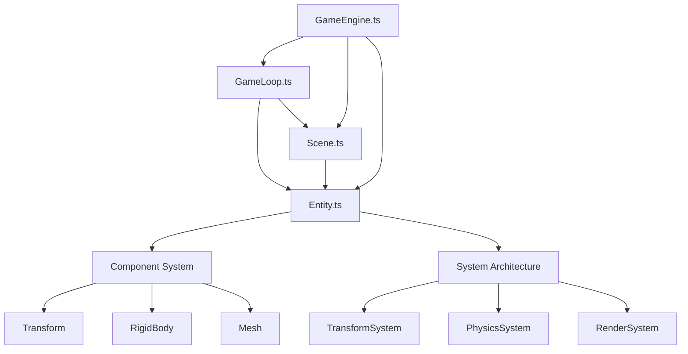

# Phase 2: Core Game Engine - Detailed File Breakdown

## Overview

Phase 2 involves creating the **Core Game Engine**, which is much more extensive than just 4 files. Each main component includes numerous sub-systems, utilities, types, and supporting files.

---

## Complete Phase 2 File Structure

### 1. GameEngine.ts - Main Engine Orchestrator

**Primary File:**
```
src/engine/core/GameEngine.ts
```

**Supporting Files & Sub-Systems:**

```
src/engine/core/
├── GameEngine.ts                    # Main engine class
├── EngineConfig.ts                  # Engine configuration
├── EngineState.ts                   # Engine state management
├── ModuleManager.ts                 # Module loading/unloading
├── SystemRegistry.ts                # System registration
├── PerformanceMonitor.ts            # Performance tracking
├── ResourceManager.ts               # Resource loading/caching
├── AssetLoader.ts                   # Asset loading system
├── EventEmitter.ts                  # Event system
└── EngineError.ts                   # Error handling

src/engine/core/modules/
├── PhysicsModule.ts                 # Physics system module
├── RenderModule.ts                  # Rendering system module
├── InputModule.ts                   # Input system module
├── AudioModule.ts                   # Audio system module
└── NetworkModule.ts                 # Network system module (future)

src/engine/core/lifecycle/
├── EngineLifecycle.ts              # Lifecycle management
├── InitializationPhase.ts          # Initialization
├── StartupPhase.ts                 # Startup
├── ShutdownPhase.ts                # Cleanup
└── PauseResumeManager.ts           # Pause/resume logic

src/types/engine/
├── EngineTypes.ts                  # Engine type definitions
├── ModuleTypes.ts                  # Module interfaces
├── SystemTypes.ts                  # System interfaces
└── ConfigTypes.ts                  # Configuration types
```

**Total Files for GameEngine System: ~20 files**

---

### 2. GameLoop.ts - Fixed Timestep Loop

**Primary File:**
```
src/engine/core/GameLoop.ts
```

**Supporting Files & Sub-Systems:**

```
src/engine/core/loop/
├── GameLoop.ts                      # Main game loop
├── FixedTimestep.ts                # Fixed timestep implementation
├── Accumulator.ts                  # Time accumulator
├── DeltaTime.ts                    # Delta time calculation
├── FrameTimer.ts                   # Frame timing
├── UpdateScheduler.ts              # Update scheduling
└── RenderScheduler.ts              # Render scheduling

src/engine/core/loop/phases/
├── PreUpdate.ts                    # Pre-update phase
├── FixedUpdate.ts                  # Fixed update phase
├── Update.ts                       # Variable update phase
├── LateUpdate.ts                   # Late update phase
├── PreRender.ts                    # Pre-render phase
└── PostRender.ts                   # Post-render phase

src/engine/core/performance/
├── PerformanceMonitor.ts           # Performance monitoring
├── FPSCounter.ts                   # FPS tracking
├── FrameTimeTracker.ts             # Frame time tracking
├── MemoryMonitor.ts                # Memory usage tracking
├── ProfilerMarker.ts               # Profiling markers
└── PerformanceStats.ts             # Performance statistics

src/utils/time/
├── TimeUtils.ts                    # Time utilities
├── Clock.ts                        # High-precision clock
├── Timer.ts                        # Timer implementation
└── Stopwatch.ts                    # Stopwatch for profiling

src/types/loop/
├── LoopTypes.ts                    # Loop type definitions
├── TimingTypes.ts                  # Timing interfaces
└── PerformanceTypes.ts             # Performance types
```

**Total Files for GameLoop System: ~25 files**

---

### 3. Scene.ts - Scene Graph Management

**Primary File:**
```
src/engine/core/Scene.ts
```

**Supporting Files & Sub-Systems:**

```
src/engine/core/scene/
├── Scene.ts                        # Main scene class
├── SceneManager.ts                 # Scene management
├── SceneGraph.ts                   # Scene graph structure
├── SceneNode.ts                    # Scene node
├── SceneLoader.ts                  # Scene loading
├── SceneSwitcher.ts                # Scene switching
└── SceneSerializer.ts              # Scene serialization

src/engine/core/scene/hierarchy/
├── EntityHierarchy.ts              # Entity parent-child
├── Transform.ts                    # Transform component
├── TransformHierarchy.ts           # Transform hierarchy
├── WorldMatrix.ts                  # World matrix calculation
└── LocalMatrix.ts                  # Local matrix calculation

src/engine/core/scene/culling/
├── FrustumCuller.ts               # Frustum culling
├── OcclusionCuller.ts             # Occlusion culling
├── DistanceCuller.ts              # Distance culling
└── LODManager.ts                   # Level of Detail

src/engine/core/scene/spatial/
├── SpatialPartitioning.ts         # Spatial partitioning
├── Octree.ts                      # Octree implementation
├── QuadTree.ts                    # Quadtree implementation
├── BVH.ts                         # Bounding Volume Hierarchy
└── SpatialQuery.ts                # Spatial queries

src/engine/core/scene/lighting/
├── LightManager.ts                # Light management
├── AmbientLight.ts                # Ambient light
├── DirectionalLight.ts            # Directional light
├── PointLight.ts                  # Point light
├── SpotLight.ts                   # Spot light
└── LightCulling.ts                # Light culling

src/types/scene/
├── SceneTypes.ts                  # Scene type definitions
├── NodeTypes.ts                   # Node interfaces
├── HierarchyTypes.ts              # Hierarchy types
└── CullingTypes.ts                # Culling types
```

**Total Files for Scene System: ~30 files**

---

### 4. Entity.ts - Entity Component System

**Primary File:**
```
src/engine/core/Entity.ts
```

**Supporting Files & Sub-Systems:**

```
src/engine/core/entity/
├── Entity.ts                       # Main entity class
├── EntityManager.ts                # Entity management
├── EntityFactory.ts                # Entity creation
├── EntityPool.ts                   # Entity pooling
├── EntityQuery.ts                  # Entity queries
└── EntitySerializer.ts             # Entity serialization

src/engine/core/component/
├── Component.ts                    # Base component
├── ComponentManager.ts             # Component management
├── ComponentRegistry.ts            # Component registration
├── ComponentPool.ts                # Component pooling
└── ComponentSerializer.ts          # Component serialization

src/engine/core/component/types/
├── TransformComponent.ts           # Transform
├── RigidBodyComponent.ts           # Physics body
├── ColliderComponent.ts            # Collider
├── MeshComponent.ts                # 3D mesh
├── LightComponent.ts               # Light
├── CameraComponent.ts              # Camera
├── ScriptComponent.ts              # Script behavior
└── TagComponent.ts                 # Tags

src/engine/core/system/
├── System.ts                       # Base system
├── SystemManager.ts                # System management
├── SystemPriority.ts               # System ordering
└── SystemScheduler.ts              # System scheduling

src/engine/core/system/types/
├── TransformSystem.ts              # Transform updates
├── PhysicsSystem.ts                # Physics updates
├── RenderSystem.ts                 # Rendering
├── AnimationSystem.ts              # Animations
├── ScriptSystem.ts                 # Script execution
└── CollisionSystem.ts              # Collision handling

src/utils/ecs/
├── BitMask.ts                      # Component bitmasks
├── EntityID.ts                     # Entity ID generation
├── ComponentID.ts                  # Component ID generation
└── QueryBuilder.ts                 # Query builder

src/types/entity/
├── EntityTypes.ts                  # Entity type definitions
├── ComponentTypes.ts               # Component interfaces
├── SystemTypes.ts                  # System interfaces
└── QueryTypes.ts                   # Query types
```

**Total Files for Entity System: ~35 files**

---

## Additional Core Systems (Also Part of Phase 2)

### 5. State Management (Zustand)

```
src/store/
├── index.ts                        # Store exports
├── gameStore.ts                    # Game state store
├── uiStore.ts                      # UI state store
├── settingsStore.ts                # Settings store
└── debugStore.ts                   # Debug state store

src/store/slices/
├── playerSlice.ts                  # Player state
├── missionSlice.ts                 # Mission state
├── entitySlice.ts                  # Entity state
├── cameraSlice.ts                  # Camera state
└── inputSlice.ts                   # Input state

src/store/middleware/
├── persistMiddleware.ts            # State persistence
├── loggerMiddleware.ts             # State logging
└── devtoolsMiddleware.ts           # Devtools integration

src/types/store/
├── StoreTypes.ts                   # Store type definitions
├── StateTypes.ts                   # State interfaces
└── ActionTypes.ts                  # Action types
```

**Total Files for State Management: ~15 files**

---

### 6. Utilities & Helpers

```
src/utils/
├── math/
│   ├── Vector2.ts                  # 2D vector
│   ├── Vector3.ts                  # 3D vector
│   ├── Vector4.ts                  # 4D vector
│   ├── Quaternion.ts               # Quaternion
│   ├── Matrix3.ts                  # 3x3 matrix
│   ├── Matrix4.ts                  # 4x4 matrix
│   ├── MathUtils.ts                # Math utilities
│   ├── Interpolation.ts            # Interpolation
│   └── Easing.ts                   # Easing functions
│
├── geometry/
│   ├── AABB.ts                     # Axis-aligned bounding box
│   ├── OBB.ts                      # Oriented bounding box
│   ├── Sphere.ts                   # Bounding sphere
│   ├── Plane.ts                    # Plane
│   ├── Ray.ts                      # Ray
│   └── Frustum.ts                  # View frustum
│
├── helpers/
│   ├── Logger.ts                   # Logging system
│   ├── Debug.ts                    # Debug utilities
│   ├── Assert.ts                   # Assertions
│   ├── Validator.ts                # Validation
│   └── ErrorHandler.ts             # Error handling
│
└── constants/
    ├── PhysicsConstants.ts         # Physics constants
    ├── RenderConstants.ts          # Render constants
    └── GameConstants.ts            # Game constants
```

**Total Files for Utilities: ~25 files**

---

## Complete Phase 2 File Count

| System | Files | Description |
|--------|-------|-------------|
| **GameEngine** | ~20 | Main engine orchestrator |
| **GameLoop** | ~25 | Fixed timestep loop |
| **Scene** | ~30 | Scene graph management |
| **Entity** | ~35 | Entity component system |
| **State Management** | ~15 | Zustand stores |
| **Utilities** | ~25 | Math, geometry, helpers |
| **Types** | ~20 | TypeScript definitions |
| **Tests** | ~30 | Unit tests |
| **TOTAL** | **~200 files** | Complete Phase 2 |

---

## Detailed Task Breakdown

### GameEngine.ts Tasks

1. **Core Engine Class**
   - [ ] Create GameEngine class
   - [ ] Implement initialization system
   - [ ] Add module management
   - [ ] Set up lifecycle hooks
   - [ ] Add error handling

2. **Module System**
   - [ ] Create ModuleManager
   - [ ] Implement module loading
   - [ ] Add module dependencies
   - [ ] Create module interfaces
   - [ ] Add module lifecycle

3. **Resource Management**
   - [ ] Create ResourceManager
   - [ ] Implement asset loading
   - [ ] Add resource caching
   - [ ] Create asset pipeline
   - [ ] Add resource disposal

4. **Event System**
   - [ ] Create EventEmitter
   - [ ] Implement event bus
   - [ ] Add event priorities
   - [ ] Create event types
   - [ ] Add event debugging

5. **Performance Monitoring**
   - [ ] Create PerformanceMonitor
   - [ ] Track FPS
   - [ ] Monitor memory
   - [ ] Add profiling markers
   - [ ] Create performance stats

### GameLoop.ts Tasks

1. **Fixed Timestep Loop**
   - [ ] Create GameLoop class
   - [ ] Implement accumulator pattern
   - [ ] Add delta time calculation
   - [ ] Create frame timer
   - [ ] Add loop control (start/stop/pause)

2. **Update Phases**
   - [ ] Implement PreUpdate
   - [ ] Create FixedUpdate (physics)
   - [ ] Add Update (game logic)
   - [ ] Implement LateUpdate
   - [ ] Add PostUpdate

3. **Render Scheduling**
   - [ ] Create RenderScheduler
   - [ ] Implement PreRender
   - [ ] Add Render phase
   - [ ] Create PostRender
   - [ ] Add frame interpolation

4. **Performance Tracking**
   - [ ] Create FPSCounter
   - [ ] Add frame time tracking
   - [ ] Implement memory monitoring
   - [ ] Create performance graphs
   - [ ] Add profiling tools

### Scene.ts Tasks

1. **Scene Management**
   - [ ] Create Scene class
   - [ ] Implement SceneManager
   - [ ] Add scene loading
   - [ ] Create scene switching
   - [ ] Add scene serialization

2. **Scene Graph**
   - [ ] Create SceneGraph
   - [ ] Implement SceneNode
   - [ ] Add entity hierarchy
   - [ ] Create transform hierarchy
   - [ ] Add world matrix calculation

3. **Culling Systems**
   - [ ] Implement frustum culling
   - [ ] Add occlusion culling
   - [ ] Create distance culling
   - [ ] Add LOD system
   - [ ] Implement visibility testing

4. **Spatial Partitioning**
   - [ ] Create Octree
   - [ ] Implement QuadTree
   - [ ] Add BVH (Bounding Volume Hierarchy)
   - [ ] Create spatial queries
   - [ ] Add collision broadphase

5. **Lighting System**
   - [ ] Create LightManager
   - [ ] Implement light types
   - [ ] Add shadow mapping
   - [ ] Create light culling
   - [ ] Add light probes

### Entity.ts Tasks

1. **Entity System**
   - [ ] Create Entity class
   - [ ] Implement EntityManager
   - [ ] Add entity factory
   - [ ] Create entity pooling
   - [ ] Add entity queries

2. **Component System**
   - [ ] Create Component base class
   - [ ] Implement ComponentManager
   - [ ] Add component registry
   - [ ] Create component pooling
   - [ ] Add component serialization

3. **Core Components**
   - [ ] Create TransformComponent
   - [ ] Implement RigidBodyComponent
   - [ ] Add ColliderComponent
   - [ ] Create MeshComponent
   - [ ] Add LightComponent
   - [ ] Implement CameraComponent

4. **System Architecture**
   - [ ] Create System base class
   - [ ] Implement SystemManager
   - [ ] Add system priorities
   - [ ] Create system scheduler
   - [ ] Add system dependencies

5. **Core Systems**
   - [ ] Create TransformSystem
   - [ ] Implement PhysicsSystem
   - [ ] Add RenderSystem
   - [ ] Create AnimationSystem
   - [ ] Add ScriptSystem

---

## Phase 2 Timeline Estimate

| Week | Focus | Files | Status |
|------|-------|-------|--------|
| **Week 1** | GameEngine Core | 20 files | ⏳ Pending |
| **Week 2** | GameLoop & Performance | 25 files | ⏳ Pending |
| **Week 3** | Scene Management | 30 files | ⏳ Pending |
| **Week 4** | Entity Component System | 35 files | ⏳ Pending |
| **Week 5** | State Management & Utilities | 40 files | ⏳ Pending |
| **Week 6** | Testing & Documentation | 50 files | ⏳ Pending |

**Total Estimated Time: 6 weeks**

---

## Dependencies Between Systems



---

## Testing Strategy

Each system will have comprehensive tests:

```
tests/
├── engine/
│   ├── GameEngine.test.ts
│   ├── GameLoop.test.ts
│   ├── Scene.test.ts
│   └── Entity.test.ts
├── components/
│   ├── Transform.test.ts
│   ├── RigidBody.test.ts
│   └── Mesh.test.ts
├── systems/
│   ├── TransformSystem.test.ts
│   ├── PhysicsSystem.test.ts
│   └── RenderSystem.test.ts
└── utils/
    ├── Math.test.ts
    └── Geometry.test.ts
```

**Total Test Files: ~30 files**

---

## Documentation Updates

Each system will be documented:

```
docs/engine/
├── GameEngine.md
├── GameLoop.md
├── Scene.md
├── Entity.md
├── Components.md
└── Systems.md
```

---

## Summary

**Phase 2 is NOT just 4 files!**

It includes:
- ✅ **~200 total files**
- ✅ **20+ sub-systems**
- ✅ **30+ components**
- ✅ **15+ systems**
- ✅ **25+ utilities**
- ✅ **30+ tests**
- ✅ **Complete documentation**

Each main file (GameEngine.ts, GameLoop.ts, Scene.ts, Entity.ts) is actually a **complete system** with many supporting files, utilities, types, and tests.

---

**This is a proper game engine!** 🎮🚀
