# Space Game Engine - Architecture Diagrams (Mermaid)

This document contains all architectural diagrams for the Space Game Engine using Mermaid syntax. These diagrams can be viewed in any Mermaid-compatible viewer or GitHub.

## Table of Contents
1. [System Architecture](#system-architecture)
2. [Component Hierarchy](#component-hierarchy)
3. [Data Flow](#data-flow)
4. [Game Loop](#game-loop)
5. [Physics System](#physics-system)
6. [State Management](#state-management)
7. [Entity Component System](#entity-component-system)
8. [Rendering Pipeline](#rendering-pipeline)

---

## System Architecture

### High-Level System Architecture

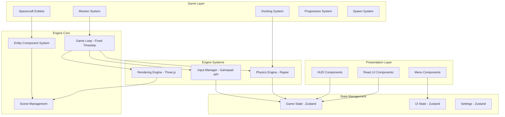

### Module Dependency Graph

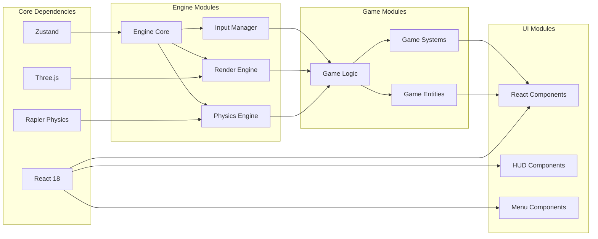

---

## Component Hierarchy

### React Component Tree

```mermaid
graph TD
    App[App]
    
    App --> GameCanvas[GameCanvas]
    App --> HUD[HUD]
    App --> UI[UI]
    
    GameCanvas --> Scene[Scene]
    GameCanvas --> Camera[Camera]
    
    Scene --> Lighting[Lighting]
    Scene --> Environment[Environment]
    Scene --> Entities[Entities]
    Scene --> Effects[Effects]
    
    Lighting --> AmbientLight[AmbientLight]
    Lighting --> DirectionalLight[DirectionalLight]
    Lighting --> PointLight[PointLight]
    
    Environment --> Starfield[Starfield]
    Environment --> Planets[Planets]
    Environment --> Asteroids[Asteroids]
    
    Entities --> Spacecraft[Spacecraft]
    Entities --> SpaceStation[SpaceStation]
    
    Spacecraft --> RigidBody1[RigidBody]
    Spacecraft --> Collider1[Collider]
    Spacecraft --> Thrusters[Thrusters]
    Spacecraft --> Model1[3D Model]
    
    SpaceStation --> RigidBody2[RigidBody]
    SpaceStation --> DockingPorts[DockingPorts]
    SpaceStation --> Model2[3D Model]
    
    Effects --> ParticleSystem[ParticleSystem]
    Effects --> PostProcessing[PostProcessing]
    
    Camera --> CameraController[CameraController]
    
    HUD --> VelocityIndicator[VelocityIndicator]
    HUD --> AlignmentDisplay[AlignmentDisplay]
    HUD --> FuelGauge[FuelGauge]
    HUD --> DistanceIndicator[DistanceIndicator]
    HUD --> MissionObjective[MissionObjective]
    
    UI --> MainMenu[MainMenu]
    UI --> MissionSelect[MissionSelect]
    UI --> Settings[Settings]
    UI --> PauseMenu[PauseMenu]
    
    style App fill:#06b6d4
    style GameCanvas fill:#3fb950
    style HUD fill:#f59e0b
    style UI fill:#a855f7
```

---

## Data Flow

### Game Loop Data Flow

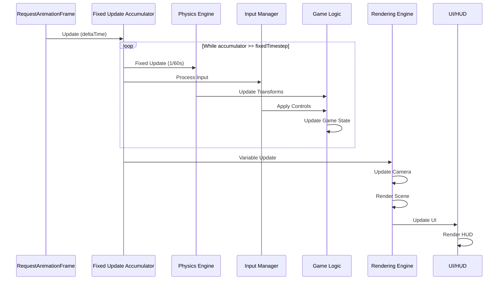

### State Flow Diagram

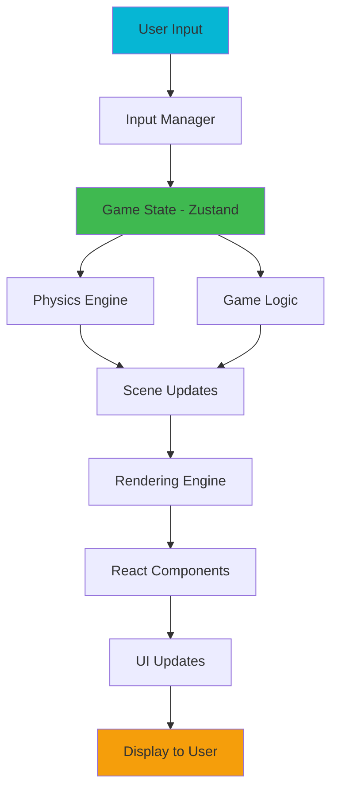

### Event Flow

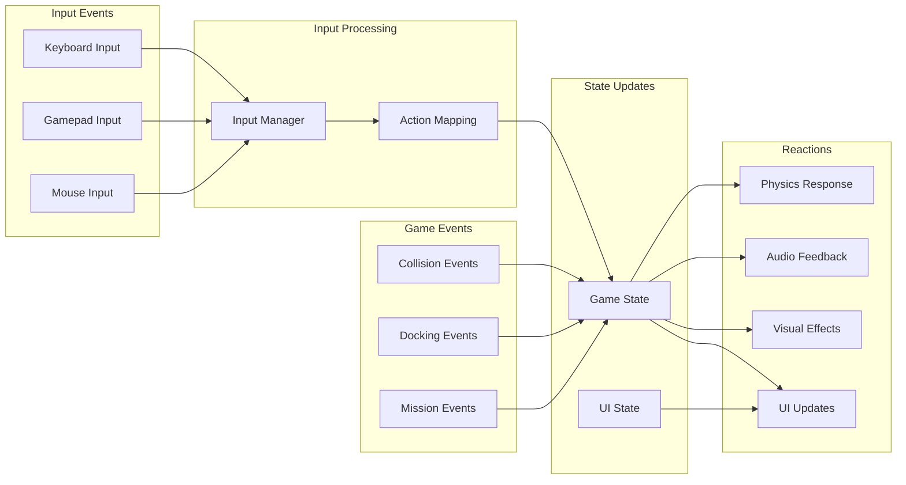

---

## Game Loop

### Fixed Timestep Game Loop

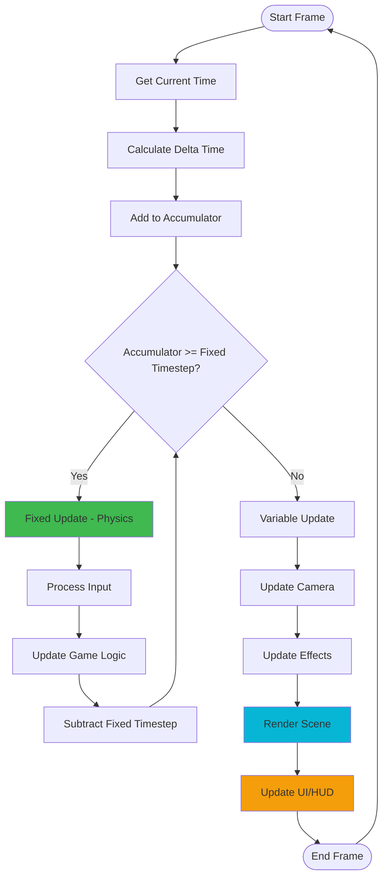

### Update Cycle Timing

```mermaid
gantt
    title Game Loop Timing (16.67ms per frame @ 60 FPS)
    dateFormat X
    axisFormat %L ms
    
    section Physics
    Fixed Update 1    :0, 1
    Fixed Update 2    :1, 2
    Fixed Update 3    :2, 3
    
    section Input
    Process Input     :3, 5
    
    section Game Logic
    Update Entities   :5, 8
    Update Systems    :8, 10
    
    section Rendering
    Update Camera     :10, 11
    Render Scene      :11, 15
    
    section UI
    Update HUD        :15, 16
```

---

## Physics System

### Physics Update Flow

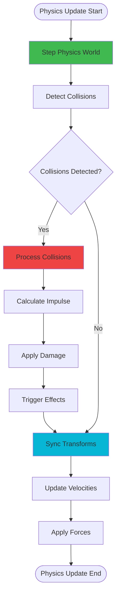

### Spacecraft Physics

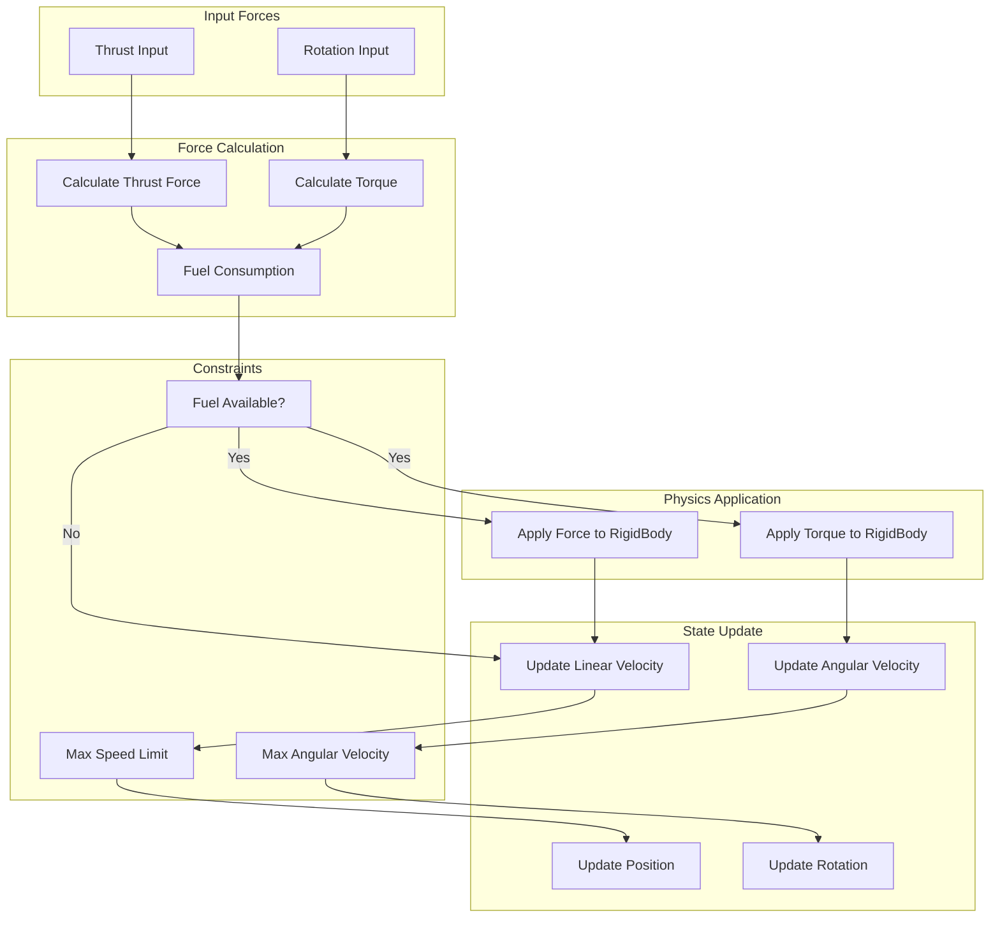

### Collision Detection

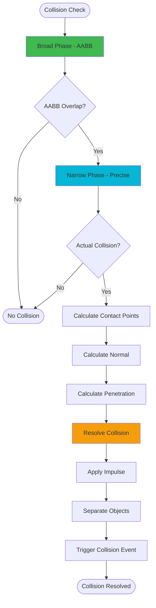

---

## State Management

### Zustand Store Architecture

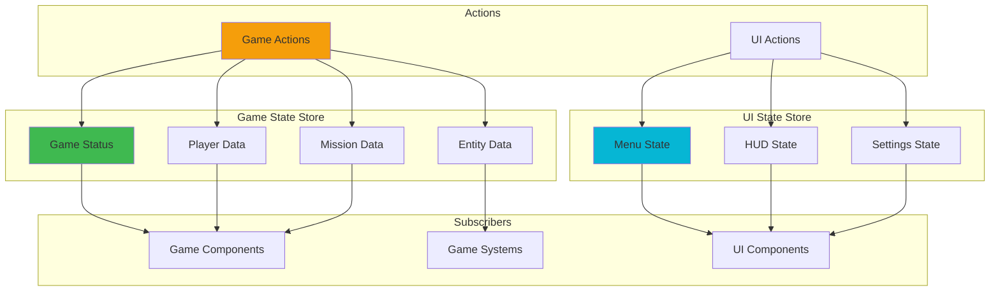

### State Update Flow

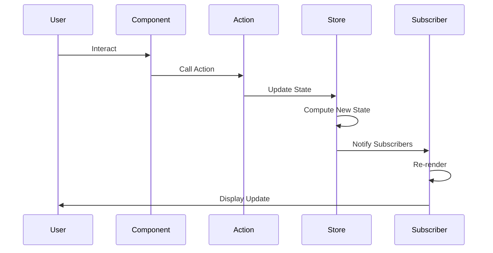

---

## Entity Component System

### ECS Architecture

```mermaid
graph TD
    subgraph "Entities"
        Spacecraft[Spacecraft Entity]
        Station[Station Entity]
        Asteroid[Asteroid Entity]
    end
    
    subgraph "Components"
        Transform[Transform Component]
        RigidBody[RigidBody Component]
        Collider[Collider Component]
        Thruster[Thruster Component]
        Fuel[Fuel Component]
        Health[Health Component]
        Model[Model Component]
    end
    
    subgraph "Systems"
        PhysicsSystem[Physics System]
        RenderSystem[Render System]
        InputSystem[Input System]
        DockingSystem[Docking System]
    end
    
    Spacecraft --> Transform
    Spacecraft --> RigidBody
    Spacecraft --> Collider
    Spacecraft --> Thruster
    Spacecraft --> Fuel
    Spacecraft --> Health
    Spacecraft --> Model
    
    Station --> Transform
    Station --> RigidBody
    Station --> Collider
    Station --> Model
    
    Asteroid --> Transform
    Asteroid --> RigidBody
    Asteroid --> Collider
    Asteroid --> Model
    
    PhysicsSystem --> RigidBody
    PhysicsSystem --> Collider
    
    RenderSystem --> Transform
    RenderSystem --> Model
    
    InputSystem --> Thruster
    InputSystem --> Fuel
    
    DockingSystem --> Transform
    DockingSystem --> RigidBody
    
    style Spacecraft fill:#3fb950
    style PhysicsSystem fill:#06b6d4
    style Transform fill:#f59e0b
```

### Component Lifecycle

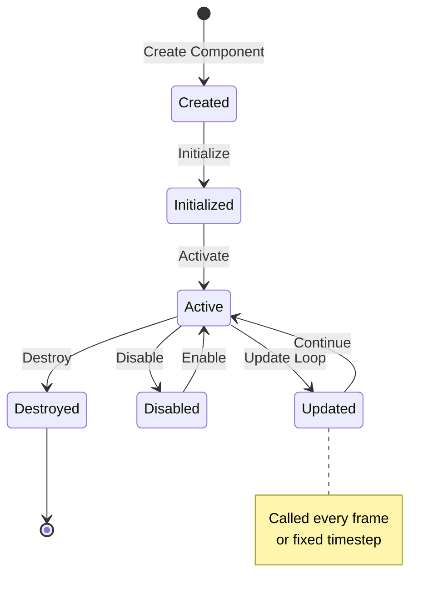

---

## Rendering Pipeline

### Three.js Rendering Pipeline

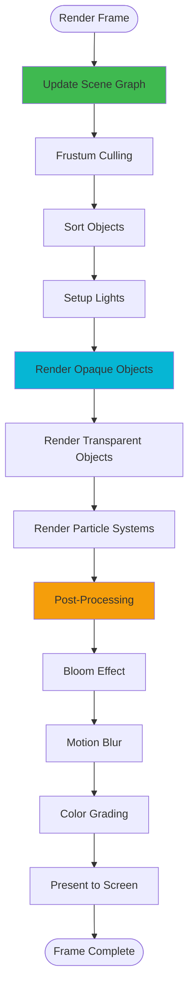

### Render Order

```mermaid
graph LR
    subgraph "Render Pass 1: Opaque"
        Skybox[Skybox]
        Planets[Planets]
        Stations[Space Stations]
        Spacecraft[Spacecraft]
        Asteroids[Asteroids]
    end
    
    subgraph "Render Pass 2: Transparent"
        Thrusters[Thruster Flames]
        Trails[Motion Trails]
        Shields[Energy Shields]
    end
    
    subgraph "Render Pass 3: Effects"
        Particles[Particle Systems]
        Explosions[Explosions]
        Lights[Light Glows]
    end
    
    subgraph "Render Pass 4: Post-Processing"
        Bloom[Bloom]
        Blur[Motion Blur]
        Grading[Color Grading]
    end
    
    Skybox --> Planets
    Planets --> Stations
    Stations --> Spacecraft
    Spacecraft --> Asteroids
    
    Asteroids --> Thrusters
    Thrusters --> Trails
    Trails --> Shields
    
    Shields --> Particles
    Particles --> Explosions
    Explosions --> Lights
    
    Lights --> Bloom
    Bloom --> Blur
    Blur --> Grading
```

### Camera System

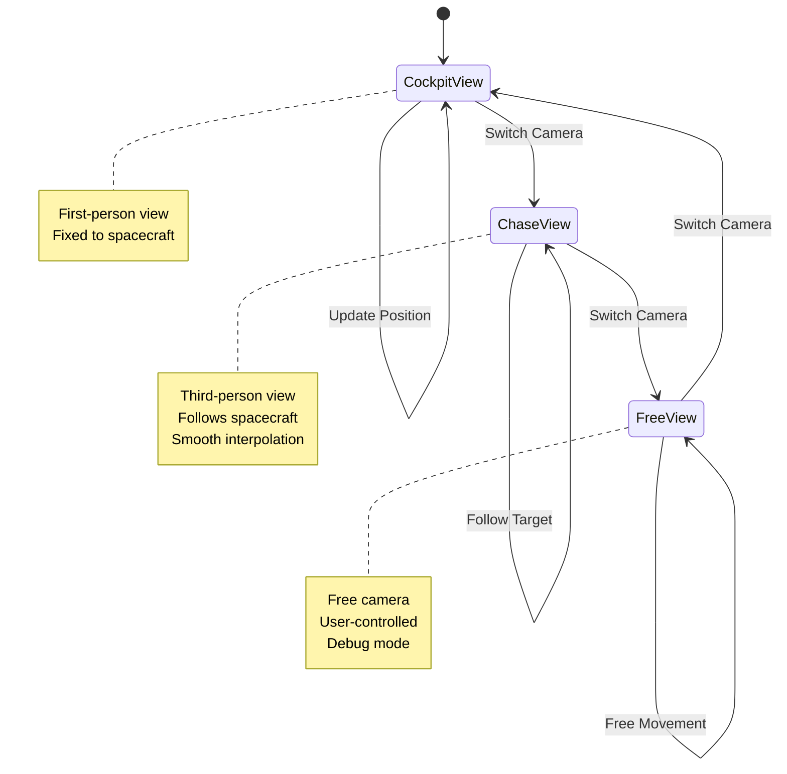

---

## Docking System

### Docking State Machine

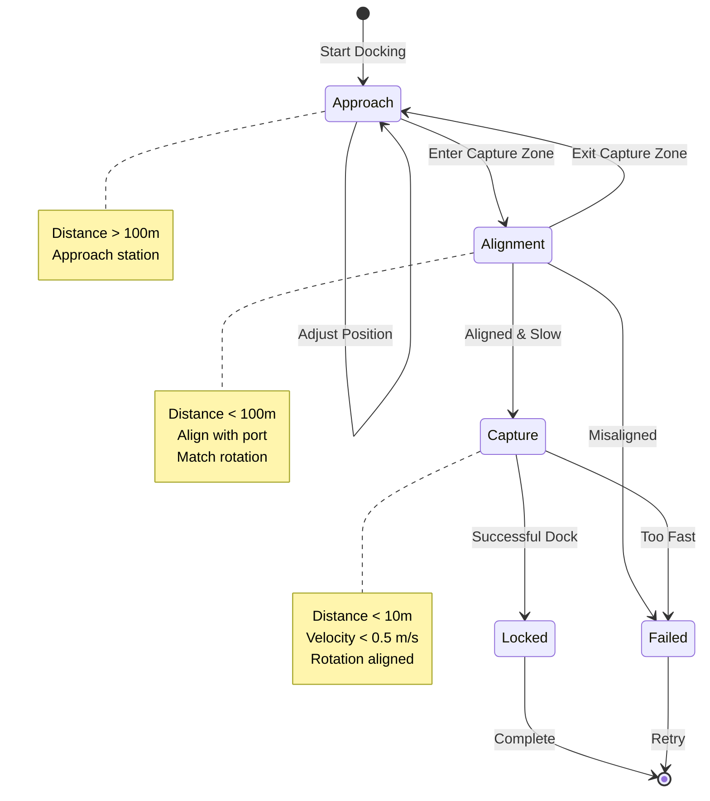

### Docking Alignment Check

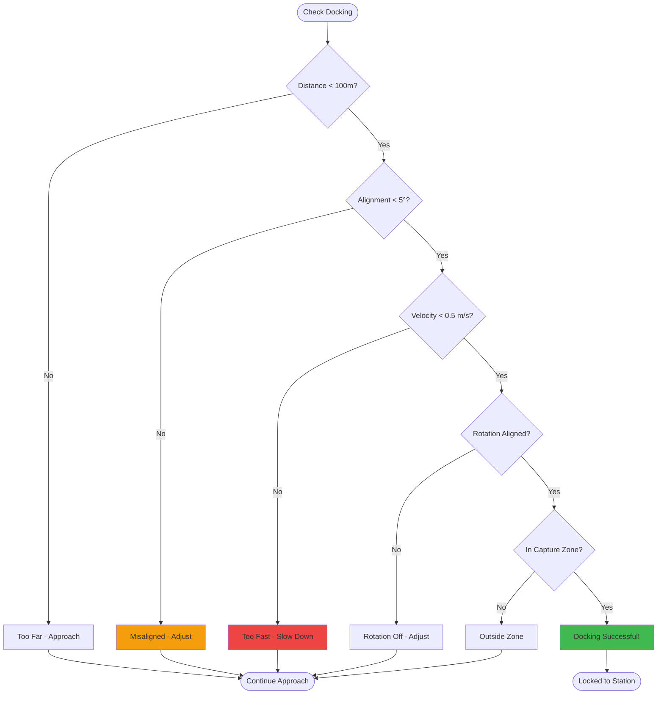

---

## Mission System

### Mission Flow

```mermaid
flowchart TD
    Start([Mission Start]) --> LoadMission[Load Mission Data]
    LoadMission --> SpawnEntities[Spawn Entities]
    SpawnEntities --> SetObjectives[Set Objectives]
    
    SetObjectives --> WaitStart[Wait for Player]
    WaitStart --> MissionActive[Mission Active]
    
    MissionActive --> CheckObjectives{Check Objectives}
    
    CheckObjectives -->|Incomplete| UpdateProgress[Update Progress]
    UpdateProgress --> MissionActive
    
    CheckObjectives -->|Complete| CheckTime{Within Time Limit?}
    
    CheckTime -->|Yes| CheckFuel{Fuel Remaining?}
    CheckTime -->|No| MissionFailed[Mission Failed]
    
    CheckFuel -->|Yes| CheckDamage{Damage < Threshold?}
    CheckFuel -->|No| MissionFailed
    
    CheckDamage -->|Yes| CalcScore[Calculate Score]
    CheckDamage -->|No| MissionFailed
    
    CalcScore --> MissionSuccess[Mission Success!]
    
    MissionSuccess --> UnlockRewards[Unlock Rewards]
    MissionFailed --> ShowResults[Show Results]
    
    UnlockRewards --> End([Mission Complete])
    ShowResults --> End
    
    style MissionSuccess fill:#3fb950
    style MissionFailed fill:#ef4444
    style MissionActive fill:#06b6d4
```

---

*These diagrams provide a comprehensive visual representation of the Space Game Engine architecture. They can be viewed in any Mermaid-compatible viewer, including GitHub, GitLab, or dedicated Mermaid editors.*

**To view these diagrams:**
1. Copy the Mermaid code blocks
2. Paste into [Mermaid Live Editor](https://mermaid.live/)
3. Or view directly on GitHub (supports Mermaid natively)
